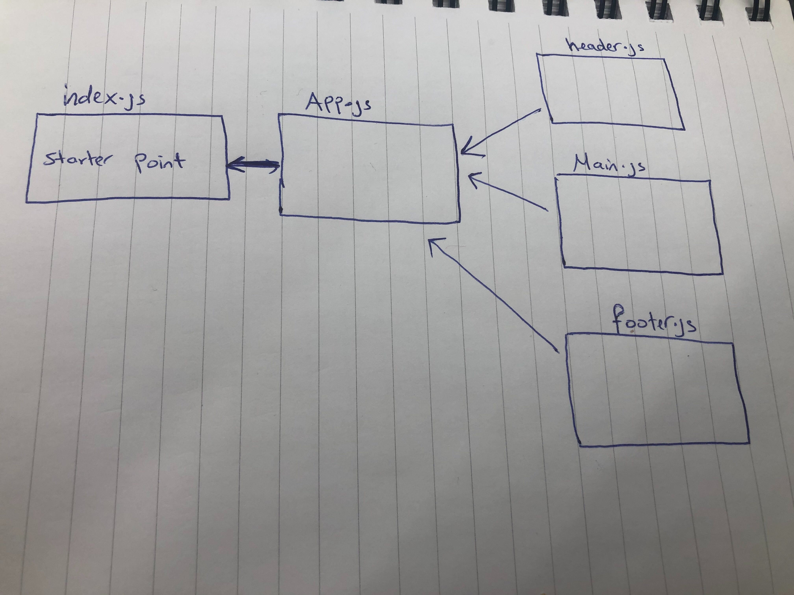

# React Testing And Deployment

## Class :27

### Author: Muna 

### Links and Resources

- [submission PR](https://github.com/401-advanced-javascript-muna/lab-26-component-based-ui/pull/1)

#### How to initialize/run your application (where applicable)

-  `npm run start`

#### How to test  your application (where applicable)

-  `npm run test`

#### UML

Link to an image of the UML for your application and response to events

